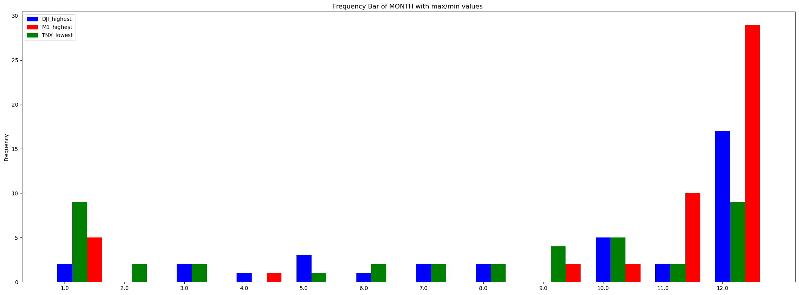
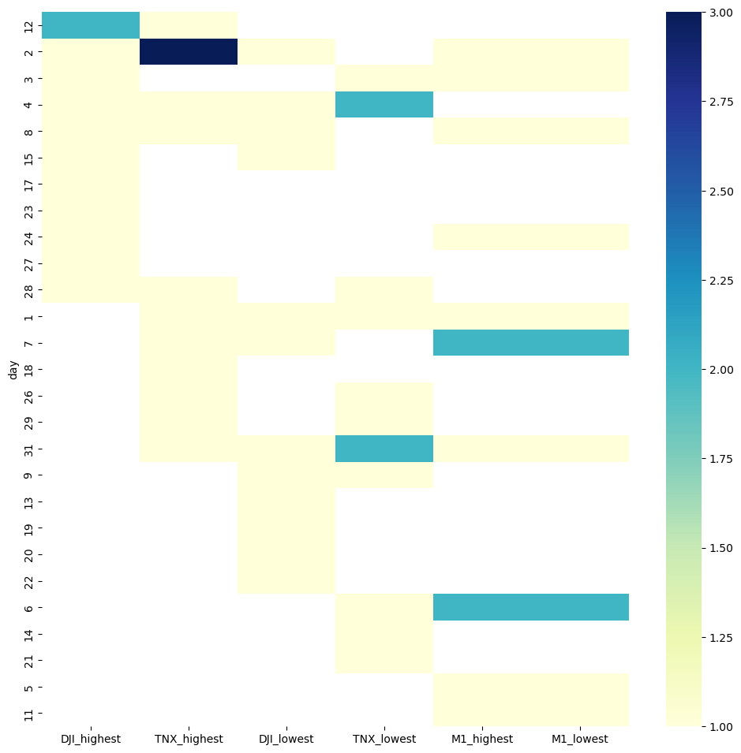
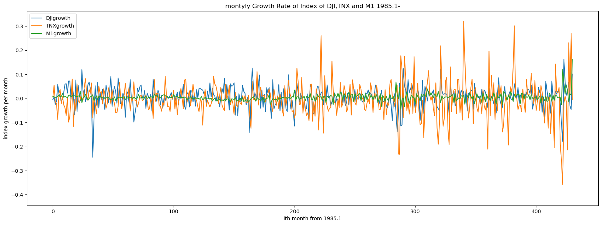
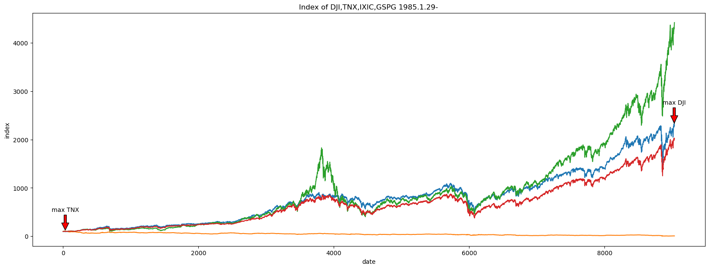
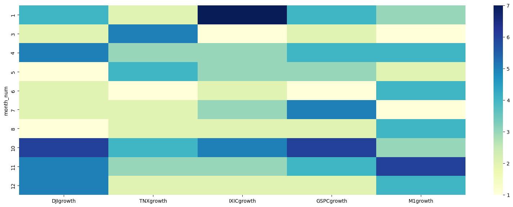

# Analysis of Calendar Effect of Stock Market
---
This simple analysis focuses on the calendar effect of stock market. As most main stock markets of US rises to an all-time high recently, people would concern about the risk. 
Some researchers believe that the behaviour of stock market is related to the calendar.
This project combines several indeces of stock market and money market to one single table, analyze the connections between the price/index/amount and the calendar.
Of course it's not enough for a actrual stratage! Real market is much more complex and thousands of models have been established by researchers. It's a practice of SQL and python. I will explore some new technologies and share them later.

Datasets in this research:

DJI:Dow Jones Industrial Average, Frequency: daily

https://finance.yahoo.com/quote/%5EDJI/history?p=%5EDJI

TNX:Treasury Yield 10 Years, Frequency: daily

https://finance.yahoo.com/quote/%5ETNX/history?p=%5ETNX

IXIC:NASDAQ Composite, Frequency: daily

https://finance.yahoo.com/quote/%5EIXIC/history?p=%5EIXIC

GSPC:S&P 500, Frequency: daily

https://finance.yahoo.com/quote/%5EGSPC/history?p=%5EGSPC

M1:includes funds that are readily accessible for spending, Frequency: Weekly

https://fred.stlouisfed.org/series/M1

---

---
# Conclusion
There is **Calendar Effect** in stock market. 

1.Calendar effect of MONTH: according to the bar graph and the heat map, December/January is the best trading(buy/sell) month in a year for most indices(DJI/TNX). That make sense because M1 is the most likely to have the max/min value in these two months.
DJI/GSPC and M1 mostly get the highest growth rate in the last season(winter). In contrast, TNX/IXIC is more likely to get the highest growth rate in the first season(spring).

2.Calendar effect of DAYs: according to the heat map, the beginning and the end of a month is the best trading(buy/sell) day in a month for most indices(DJI/TNX). That's resonable because M1 is most likely to has the max/min value in 6th or 7th of a month. In addition, the highest DJI(4th) is always near the highest TNX(2nd) or the lowest TNX(4th or 31st). 
